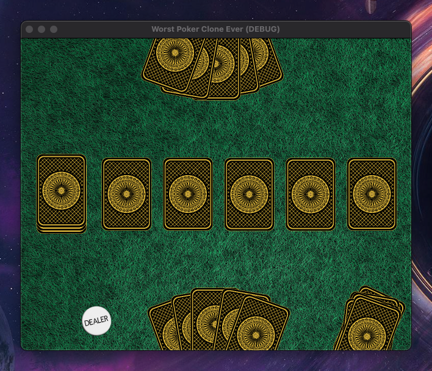

# Welcome

Welcome to my first ever Godot project! I've been a lifelong video game fan and have always wanted to build games but never quite made my way into the industry. I figured this could be a cool way to mess around with a tech I don't normally get to use and learn a little bit about the art of making video games in 2024. I expect that there are going to be a lot of things I do wrong here in this repo and so I'm open to feedback and ideas.

## Current State of the Game

## Todo
- Layout
    - Add burn pile
    - Add flop, turn, and river
    - Add UI for restarting game
- Assets
    - Create card faces
- Sounds
    - Background music
    - Shuffle sound
- Animation
    - Card dealing
    - Burning
    - Flop
    - Turn
    - River

## Color Palette
-  `Felt #35654d`
-  `Card Back #000000`
-  `Card Highlight #d4af37`